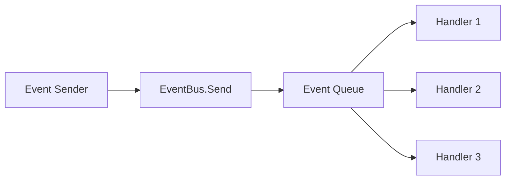

# Core Concepts

Understanding the fundamental concepts of Unity EventBus will help you build robust, maintainable event-driven systems.

## What is an Event?

An **event** is a simple C# class that carries data from one part of your system to another. Think of it as a message with information.

```csharp
// Simple event - just data
public class PlayerDiedEvent
{
    public string PlayerName { get; set; }
    public int FinalScore { get; set; }
    public Vector3 DeathPosition { get; set; }
}
```

Events are:
- **Immutable by design** - Once created, they shouldn't change
- **Data containers** - They carry information, not behavior
- **Type-safe** - Each event type is distinct

## What is a Handler?

A **handler** is a function that gets called when an event is sent. It's your code that responds to the event.

```csharp
// Handler function
void OnPlayerDied(PlayerDiedEvent evt)
{
    Debug.Log($"Player {evt.PlayerName} died with score {evt.FinalScore}");
    ShowGameOverScreen();
    PlayDeathSound();
}
```

Handlers are:
- **Event-specific** - Each handler is designed for a particular event type
- **Stateless** - They should be pure functions when possible
- **Focused** - Each handler should do one thing well

## The Event Bus

The **Event Bus** is the central hub that connects event senders with event handlers. It's like a postal service for your events.

```csharp
// The EventBus handles the routing automatically
EventBus.Send(new PlayerDiedEvent { PlayerName = "Player1", FinalScore = 1000 });
// ↑ This event will be delivered to all registered handlers
```

The EventBus:
- **Decouples** senders from receivers
- **Manages** the delivery of events
- **Handles** threading and execution order
- **Provides** type safety

## Basic Event Flow

Here's how events flow through your system:



1. **Sender** creates and sends an event
2. **EventBus** queues the event for processing
3. **Handlers** receive the event and execute their code

## Event Types

### Simple Events
Basic events that go to all registered handlers:

```csharp
public class GameStartedEvent
{
    public string LevelName { get; set; }
    public int Difficulty { get; set; }
}

// All handlers receive this event
EventBus.Send(new GameStartedEvent { LevelName = "Level 1", Difficulty = 3 });
```

### Routed Events
Events that go to specific handlers based on an ID:

```csharp
public class PlayerHealthChangedEvent : IRoutableEvent
{
    public Guid AggregateId { get; set; }  // This makes it routable
    public int NewHealth { get; set; }
    public int MaxHealth { get; set; }
}

// Only handlers registered for this specific player receive the event
EventBus.Send(new PlayerHealthChangedEvent 
{ 
    AggregateId = playerId, 
    NewHealth = 80, 
    MaxHealth = 100 
});
```

## Handler Registration

You register handlers to tell the EventBus which events you want to receive:

```csharp
// Register a handler for all events of this type
EventBus.RegisterUnityHandler<PlayerDiedEvent>(OnPlayerDied);

// Register a handler for specific player events only
EventBus.RegisterUnityHandler<PlayerHealthChangedEvent>(OnHealthChanged, playerId);
```

## Threading Concepts

Unity EventBus handles threading automatically, but it's important to understand the options:

### Unity Main Thread
```csharp
// Safe for Unity API access
EventBus.RegisterUnityHandler<PlayerEvent>(OnPlayerEvent);
```

### Background Thread
```csharp
// Good for heavy processing
EventBus.RegisterBackgroundHandler<DataEvent>(ProcessData);
```

### Immediate Thread
```csharp
// Runs immediately on current thread
EventBus.RegisterImmediateHandler<ValidationEvent>(ValidateInput);
```

## Event Lifecycle

Understanding the event lifecycle helps you build better systems:

1. **Creation** - Event object is created with data
2. **Sending** - Event is sent to the EventBus
3. **Queuing** - Event is added to the processing queue
4. **Dispatching** - Event is delivered to handlers
5. **Processing** - Handlers execute their code
6. **Cleanup** - Event is disposed of

## Common Patterns

### Observer Pattern
```csharp
// Multiple objects can observe the same event
EventBus.RegisterUnityHandler<PlayerDiedEvent>(UpdateUI);
EventBus.RegisterUnityHandler<PlayerDiedEvent>(SaveScore);
EventBus.RegisterUnityHandler<PlayerDiedEvent>(PlaySound);
```

### Command Pattern
```csharp
// Events can represent commands
public class MovePlayerCommand
{
    public Vector3 TargetPosition { get; set; }
    public float Speed { get; set; }
}

EventBus.Send(new MovePlayerCommand { TargetPosition = new Vector3(10, 0, 5), Speed = 5f });
```

### State Change Pattern
```csharp
// Events can represent state changes
public class GameStateChangedEvent
{
    public GameState OldState { get; set; }
    public GameState NewState { get; set; }
}
```

## Best Practices for Events

1. **Keep events simple** - They should carry data, not behavior
2. **Use descriptive names** - `PlayerDiedEvent` is better than `Event1`
3. **Make events immutable** - Don't change event data after creation
4. **Group related data** - Put related information in the same event
5. **Use enums for states** - Better than magic numbers or strings

## Best Practices for Handlers

1. **Keep handlers focused** - Each handler should do one thing
2. **Handle errors gracefully** - Don't let handler errors crash the system
3. **Avoid side effects** - Handlers should be predictable
4. **Use appropriate threading** - Choose the right dispatcher for your needs
5. **Clean up resources** - Dispose of handlers when no longer needed

## Next Steps

Now that you understand the core concepts, let's build a complete example:

**➡️ Continue to [04-Your First Event System](04-Your-First-Event-System)**

---

## Quick Reference

| Concept | Description | Example |
|---------|-------------|---------|
| **Event** | Data class carrying information | `PlayerDiedEvent` |
| **Handler** | Function that responds to events | `OnPlayerDied()` |
| **EventBus** | Central hub for event delivery | `EventBus.Send()` |
| **Registration** | Telling EventBus which events to handle | `RegisterUnityHandler()` |
| **Threading** | Where handlers execute | `UnityDispatcher`, `ThreadPoolDispatcher` |